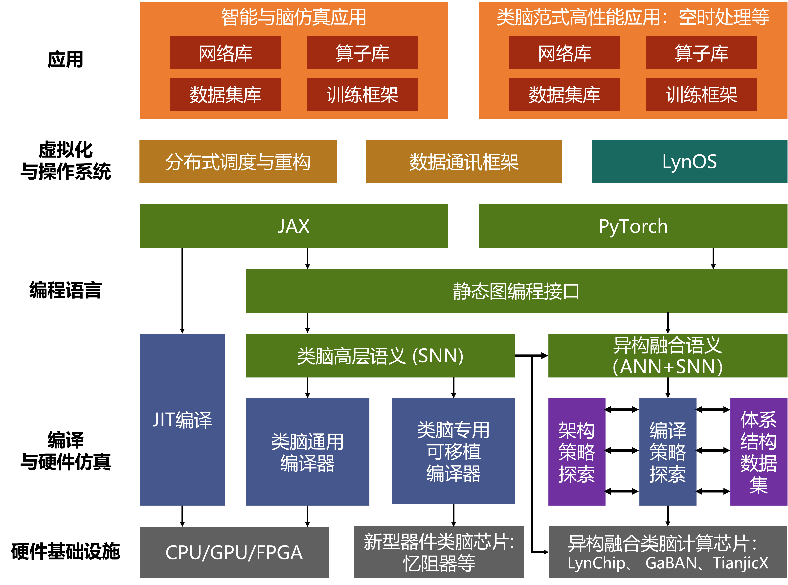

# OpenBII 项目简介

OpenBII (Open Brain Inspired Intelligence) 在“中国脑计划”框架下，旨在构建完整的类脑计算软件栈。总体思想为总体协调、框架先行、逐步开源、逐步融合。使“中国脑计划”相关成果具有更大、更广泛的影响力。助力类脑计算生态构建。

## 项目构成

(https://github.com/openBII/.github/blob/master/figures/First_stage.png)

